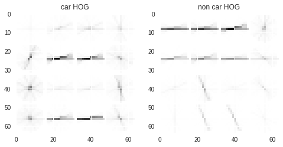
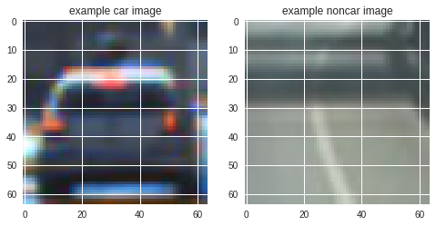
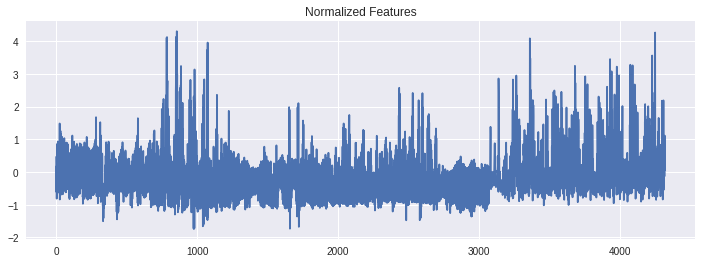
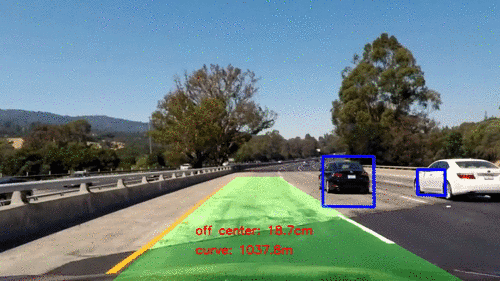

# Vehicle detection using Hisogram of Oriented Gradients (HOG) features
This project aims to detect vehicles in a video file using image features and SVM classifiers.

## Final pipeline
After experimentation (see below), I came up with the following pipeline in [vehicle_detection.py](vehicle_detection.py) to process a video:

* Feature vector: design a feature vector for vehicle images vs. non-vehicle images
* Classifer: train a SVM classifier using the project data set.
* Feature extraction: extract the feature vector for each frame of the video.
    * the sliding window method is used: two window sizes of 64x64 and 128x128 are used to scan the lower-half region of each image frame to exclude objects above the horizon.
    * After feature vector is constructed for each patch, a pre-trained SVM classifier is applied to determine whether this patch is a vehicle.
* Heatmap: a snapshot heatmap of the current image frame is constructed by assigning pixel values of accumulating '1's sliding windows and the classifier determine the pixel should represents a vehicle.
    * A ring-buffer of heatmap cache is updated by appending new snapshot heatmaps.
    * The accumulative heatmap from the heatmap cache is used to represent the current image.
* Identify regions for vehicles: a threshold is used to drop any pixels in the accumulative heatmap if their pixel values are below the threshold.
    * the result is a binary-version image on which islands of '1's represent a detection of vehicle
* Detect cars: draw bounding boxes around the islands, which are representations of vehicles on the original image.

# Method for feature extraction
I explored color histogram, color spatial binning and HOG features. Different color spaces, bin sizes, filter sizes, and HOG parameters are explored. I ended up constructing the feature vector using 'HLS' color-space histogram and a two-level (64x64 and 128x128) HOG features.
The function for feature extraction is [here](https://github.com/bo-rc/CarND-Vehicle-Detection/blob/master/util.py#L154), which is a modified version of the one appeared in class.

There involved a lot of trial-and-error experiments, finally I chose the following HOG parameters:
* orient=9: use 9 distinctive directions for HOG gradient binning.
* pix_per_cell=8
* hist_bins=32: bin color values to 32 bins.
* hog_channel='ALL': use all 3 channels of the image.
* spatial_feat=False: spatial binning of colors are not used for feature determination.

This parameter-tuning process is iterated during the entire pipeline. The criteria is the result of using the pipeline to detect vehicles on a test image.

## Example HOG features:

# Data preparation and feature extraction
Udacity project data set was used.

## an example of the data set:

 
Features were extracted using function [`extract_features_from_img_list`](https://github.com/bo-rc/CarND-Vehicle-Detection/blob/master/util.py#L154) and normalized using function [`get_features_norm`](https://github.com/bo-rc/CarND-Vehicle-Detection/blob/master/util.py#L205) before saving to pickle files in [feature_extraction.py](./feature_extraction.py).

## an example of the normalized feature vector:

A separate normalized features/labels data set was also saved in [feature_extraction_small.py](./feature_extraction_small.py) as the test set for validation purposes (see below).

Since the project data set contains time-series data, I shuffled normalized features/label data set before saving them.

# Traing a SVM classifier

## Parameter tuning and training

The `sklearn.svm.LinearSVC` and `sklearn.svm.SVC` algorithms were experimented. 

`GridSearchCV` was used in [tune_train.py](./tune_train.py) to search for an optimal parameter set for SVC using the small data set Udacity provided.
The penalty 'C' and kernel choices were iterated in my experiments. I found that different parameters do not matter much regarding the scores. This may be due to the small size of the data set.
For SVC, I ended up using the 'rbf' kernel and C=2 in [train.py](./train.py), as determined by [tune_train.py](./tune_train.py), on the project data set.

Classifers for both algorithms were trained but finally I used the LinearSVC for project submission since it is faster and the result is better just using the default parameters.
# Model validation
To validate the model, a separate test data set (10% split from training data) was used in [validate.py](./validate.py). The validation score is 0.9938 for SVC and 0.9905 for LinearSVC.

# Sliding window search
I used two-level sliding windows, 64x64 and 128x128, on the lower-half of the image frame. 80% overlap is used for the final pipeline.
* basically, I slided the image twice. This can be improved by sub-sampling HOG patches and we only need to compute HOG features once (See also Discussion section).

## Example sliding windows image using 25% overlap

* to reduce the complexity of the example image, here I used 25% overlap to demonstrate the pipeline. However, 80% overlap is used for the final video processing.

[!sliding windows](output_images/example_sliding_wind.jpg)

## Example feature-extracted windows

After feature extraction, operations of the classifier are carried out in function [`search_windows`](https://github.com/bo-rc/CarND-Vehicle-Detection/blob/master/util.py#L325). Then, using function [`draw_boxes`](https://github.com/bo-rc/CarND-Vehicle-Detection/blob/master/util.py#L13) we get something like this:

[!on_windows](output_images/windows.jpg)

## Detection example

[!feature example](output_images/test6-processed.jpg)

# Video Implementation

## This pipeline is applied on the project video and combined with land detection

|[YouTube HD](https://youtu.be/wQfOsQn7FW0)|
|:-------:|

## Filtering

I used a ring buffer to store historical heatmaps. The accumulative heatmap out of the ring buffer is used to determine the bounding boxes.
* the ring buffer stores 10 most-recent heatmap snapshots.
    * essentially, using a ring buffer means we are using a box-average filter for smoothing.
* a threshold of 8 is used to mask any pixels whose accumulative detection count is less than this number.
    * this is a simple mechanism to reject transient false positive detections. 
* those hyperparameters can be tuned for better detection.

# Discussion

Due to the time limitation, I chose straightforward ways for the implementation. Much can be improved:
* For multi-level windows sliding, we need to calculate the highest resolution HOG features once then we can perform sub-sampling to obtain lower-resolution HOG, which will improve the performance.
* For filtering detection in a video, we can create a bounding box class and use its objects to track detection. For example, true detection will be consistent among adjacent frames and velocity can be estimated so that we can track the vehicle using predictive methods.
    * For false positive rejections, we can reject any bounding boxes whose lifetime are too short, whose sizes change dramatically or whose motion are not smooth.

