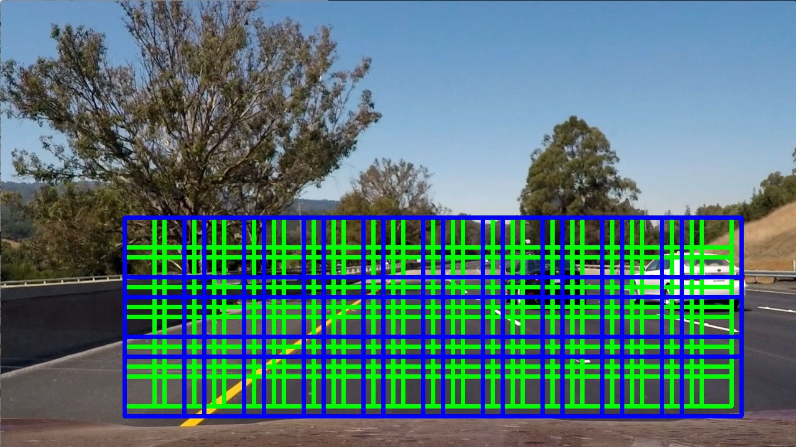
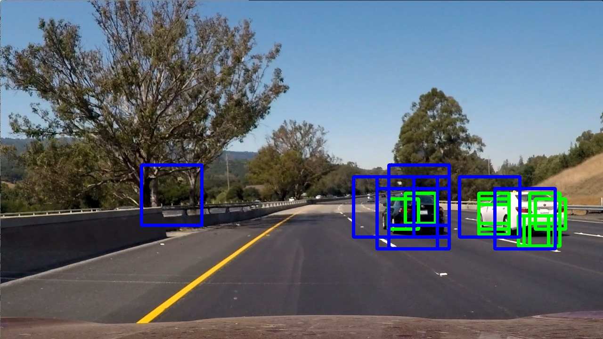
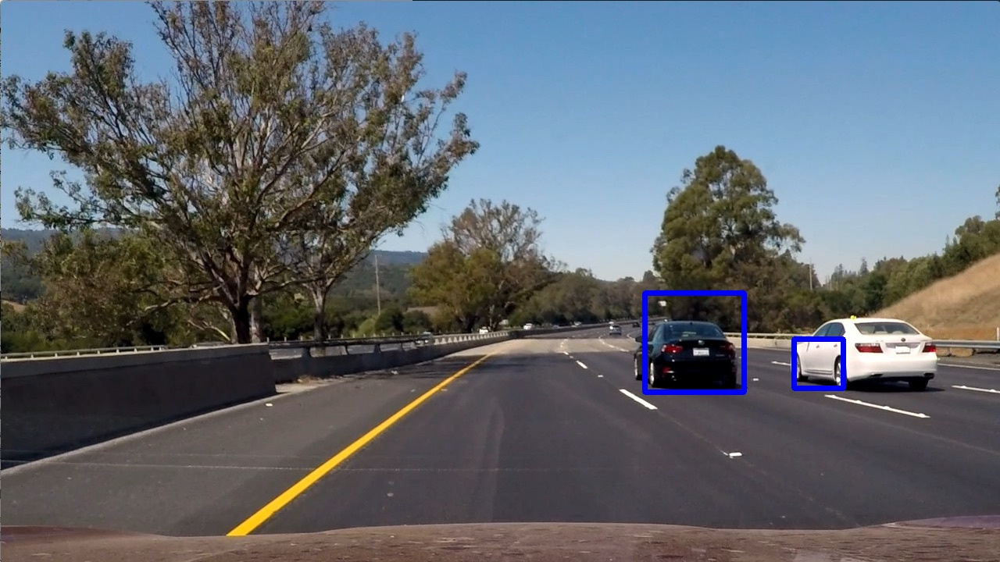

# Vehicle detection using Hisogram of Oriented Gradients (HOG) features
This project aims to detect vehicles in a video file using image features and SVM classifiers.

## Final pipeline
After experimentation (see below), I came up with the following pipeline in [`annotate_img_vehicle`](https://github.com/bo-rc/CarND-Vehicle-Detection/blob/master/util.py#L358) to process a video:

* Feature vector: design a feature vector for vehicle images vs. non-vehicle images
* Classifer: train a SVM classifier using the project data set.
* Feature extraction: extract the feature vector for each frame of the video.
    * the sliding window method is used: two window sizes of 64x64 and 96x96 are used to scan the lower-half region of each image frame to exclude objects above the horizon.
    * After feature vector is constructed for each patch, a pre-trained SVM classifier is applied to determine whether this patch is a vehicle.
* Heatmap: a snapshot heatmap of the current image frame is constructed by assigning pixel values of accumulating '1's sliding windows and the classifier determine the pixel should represents a vehicle.
    * hot regions of the heatmap signifies potential vehicles.
    * hot-enough regions of the heatmap are used to generate bounding boxes.
* Identify regions for vehicles: 
    * [Vehicle](vehicle.py) objects are used to keep track of detected cars by updating them using newly-discovered bounding boxes
    * when discovering new vehicles, a higher threshold is used to select hot bounding boxes from the heatmap and create new vehicle objects.
    * when updating existing vehicles, a lower threhold is used to select more bounding boxes.
    * If bounding boxes are close enough to an existing vehicle, the vehicle's size, center and velocity (in pixel space) are updated using the average properties of those bounding boxes.
* Draw detections: draw bounding boxes for each vehicle.

# Method for feature extraction
I explored color histogram, color spatial binning and HOG features. Different color spaces, bin sizes, filter sizes, and HOG parameters are explored. I ended up constructing the feature vector using 'HLS' color-space histogram and a two-level (64x64 and 96x96) HOG features using 'YCbCr' color space.
The function for feature extraction is [here](https://github.com/bo-rc/CarND-Vehicle-Detection/blob/master/util.py#L280), which is a modified version of the one appeared in class.

There involved a lot of trial-and-error experiments, finally I chose the following HOG parameters:
* orient=9: use 9 distinctive directions for HOG gradient binning.
* pix_per_cell=8
* hist_bins=16: bin color values to 16 bins.
* hog_channel='ALL': use all 3 channels of the image.
* spatial_feat=False: spatial binning of colors are not used for feature determination.

This parameter-tuning process is iterated during the entire pipeline. The criteria is the result of using the pipeline to detect vehicles on a test image. The finla parameters are described in [parameters.py](parameters.py).

## Example HOG features:

# Data preparation and feature extraction
Udacity project data set was used.

## an example of the data set:

 
Features were extracted using function [`extract_features_from_img_list`](https://github.com/bo-rc/CarND-Vehicle-Detection/blob/master/util.py#L154) and normalized using function [`get_features_norm`](https://github.com/bo-rc/CarND-Vehicle-Detection/blob/master/util.py#L205) before saving to pickle files in [feat_extraction.py](feat_extract_for_training.py).

## an example of the normalized feature vector:

A separate normalized features/labels data set was also saved in [feat_extract_small.py](feat_extract_for_training_small.py) for tuning training parameters and also used for validation purposes (see below).

Since the project data set contains time-series data, I shuffled normalized features/label data set before saving them.

# Traing a SVM classifier

## Parameter tuning and training

The `sklearn.svm.LinearSVC` and `sklearn.svm.SVC` algorithms were experimented. 

`GridSearchCV` was used in [tune_train.py](./tune_train.py) to search for an optimal parameter set for SVC using the small data set Udacity provided.
The penalty 'C' and kernel choices were iterated in my experiments. I found that different parameters do not matter much regarding the scores. This may be due to the small size of the data set.
For SVC, I ended up using the 'rbf' kernel and C=2 in [train.py](./train.py), as determined by [tune_train.py](./tune_train.py), on the project data set.

Classifers for both algorithms were trained but finally I used the [LinearSVC](https://github.com/bo-rc/CarND-Vehicle-Detection/blob/master/train.py#L24) for project submission since it is faster and the result is slightly better. 

## Choice of features

Different combinations of features were tested throughout the entire pipeline. It turned out that the 'YCrCb' color space works best for HOG features and 'HLS' color space works best for color histogram features. I ended up using all channels of the 'YCrCb' color space for HOG features, and just the 'S' channel of the 'HLS' color space for color histogram features. The spatial bin features was not used.

# Model validation
To validate the model, a separate test data set (10% split from training data) was used in [validate.py](./validate.py). The validation score is 0.9938 for SVC and 0.9935 for LinearSVC.

# Sliding window search
I used two-level sliding windows, 64x64 and 96x96, on the lower-half of the image frame. 75% overlap is used for the final pipeline.
* basically, I slided the image twice. This can be improved by sub-sampling HOG patches and we only need to compute HOG features once (See also Discussion section).

## Example sliding windows image using 25% overlap

* to reduce the complexity of the example image, here I used 25% overlap to demonstrate the pipeline. However, 80% overlap is used for the final video processing.

## Example feature-extracted windows

After feature extraction, operations of the classifier are carried out in function [`search_windows_naive`](https://github.com/bo-rc/CarND-Vehicle-Detection/blob/master/util.py#L303). Then, using function [`draw_boxes`](https://github.com/bo-rc/CarND-Vehicle-Detection/blob/master/helpers.py#L164) we get something like this:

## Detection example

# Video Implementation

Because processing each frames takes seconds, I used a ['DetectWorker'](DetectWorker.py) object that inherits from the 'Process' class to utilize multiprocessing on my computer. I used 5 workers and each of them process 1/5 portion of the input video in parallel. The final output video is stitched together. This way cuts my testing turnover rate to 20% but the downside is that the output video will present some discontinuity due to 5 workers do not share a common vehicle list; they process the input video separately in parallel.
## This pipeline is applied on the project video and combined with land detection

|[YouTube HD](https://youtu.be/s97deBvHUl4)|
|:-------:|

## Filtering

I used [ring buffers](https://github.com/bo-rc/CarND-Vehicle-Detection/blob/master/vehicle.py#L20) to store historical properties of the bounding boxes for each vehicle. The average of the ring buffer is used to determine the property of the vehcile's bounding box.
* the ring buffer stores 10 most-recent heatmap snapshots.
    * essentially, using a ring buffer means we are using a box-average filter for smoothing.
* using the [`apply_threshold`](https://github.com/bo-rc/CarND-Vehicle-Detection/blob/master/util.py#L373) function, a threshold of 4 is used to mask any pixels whose detection count is less than this number.
    * this is a simple mechanism to reject transient false positive detections. 
* those hyperparameters can be tuned for better detection.

During the heatmap generation step, I used a [guassian blur](https://github.com/bo-rc/CarND-Vehicle-Detection/blob/master/util.py#L374) operation to smooth the output heatmap such that adjacent islands can be combined if they are close enough. This essentially dropped noise for the drawing of windows.

# Discussion

Due to the time limitation, I chose straightforward ways for the implementation. Much can be improved:
* For multi-level windows sliding, we need to calculate the highest resolution HOG features once then we can perform sub-sampling to obtain lower-resolution HOG, which will improve the performance.
    * I implemented an initial version for this method, however, the result is not as good as the naive method which calculates HOG features separately for each sliding window. The speed-up is moderate so I did not use this method for submission. 
* For filtering detection in a video, I used a Vehicle class to track detection but the result is not that good. The reason is that this class only relies on information about bounding boxes from a heatmap. Ideally, when a vehicle is found, we should extract its properties from the image and use a template to locate the vehicle in future frames. We may also use optical flow algorithms to track the vehcile after it is discovered. 
* My test on entirely new images which the SVM model never sees before showed that the accuracy dropped by 5%. In practice, I'd like to use a CNN-based classifier.

