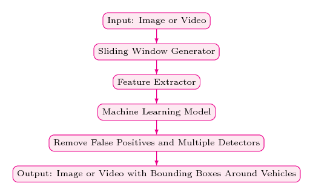
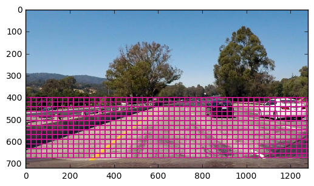
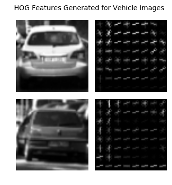
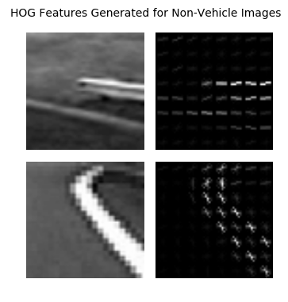

# Self-Driving Car Engineer Nanodegree
## Vehicle Detection

### Overview

The objective of this project is to identify and tracking road vehicles using traditional computer vision and machine learning techniques such as the histogram of oriented gradients (HOG) and support vector machines (SVM). In the first phase of the project, we trained a vehicle classification model using Linear SVM algorithm. The HOG, Color Histograms, and Special Binning techniques were used to extract features. Next, using sliding window technique, we extracted imaged patches from road images. Those image patches were used to extract features. The generated features were used as the input for your machine learning model. The output of the SVM model indicates whether the given patch is a vehicle or not. After removing duplicate detections and false positives, bounding boxes were drawn to indicate vehicles.

Following animation shows the performance of our final model against a road video.

<p align="center">
    
</p>

### Dependencies

This project requires Python 3.5+ and the following libraries installed.

- [Numpy](http://www.numpy.org/)
- [SciPy](https://www.scipy.org/)
- [OpenCV](http://opencv.org/)
- [Scikit-Learn](http://scikit-learn.org)
- [Matplotlib](http://matplotlib.org/) (Optional)

### How to Run the Vehicle Detector?

`python main.py`

## Implementation

### Vehicle Detection Pipeline

The following figure shows the vehicle detection pipeline we used for the project. As the picture depicted, pipeline starts with the sliding window stage. Next, the extracted image patches went to the feature generation stage. Generated features are used as the input of the SVM algorithm. Based on the output of the machine learning model, we updated the heat map. Finally, the heat map was thresholded to extract vehicle bounding boxes.

<p align="center">
   
</p>

Next, we are going to discuss these pipeline stages in detail.

### Sliding Windows for Identifying Vehicles

Vehicle detection pipeline starts with the sliding window stage. In this stage, we convolved a small window to extract image patches. The width and hight of the window and the overlap between two windows are parameters of our sliding window algorithm.

Normally, people use different window sizes and overlap in order to increase the detection accuracy. In the initial stage of the project, We also tried several window sizes, overlaps, and search areas. But, finally, we picked the following window size, overlap, and search areas which perform better on images and videos.

1. `xy_window = (96, 96)`
2. `xy_overlap = (0.75, 0.75)`
3. ` y_start_stop = [400, 600]`
4. `x_start_stop = [None, None]`

Following image shows the locations of the search windows used by our detection system.

<p align="center">
    
</p>

### Feature Extraction

The success of traditional machine learning algorithms such as SVM and logistic regression mainly depend on the features we used to train the algorithms. For this project, we used following three feature generating methods. The value used for each parameter is also given below.

1. Histogram of Oriented Gradients (HOG)
   1. `orient = 9`
   2. `pix_per_cell = 8`
   3. `cell_per_block = 2`
   4. `cspace = YCrCb`
   5. **`get_hog_features()`** method in the **`vehicle`** file.
2. Spatial Binning
   1. `nbins=32`
   2. **`bin_spatial()`** method in the **`vehicle`** file.
3. Color Histograms
   1. `color_hist = 32`
   2. **`color_hist()`** method in the **`vehicle`** file.

Following two figures show the HOG features generated for vehicle and non-vehicle gray scale images.


<p align="center">
    
</p>

<p align="center">
    
</p>

### Training the Machine Learning Model

When it comes to selecting a machine learning algorithm for vehicle tracking problem, We had two concerns namely: accuracy and speed. So We picked Linear SVM classifier because it provides a reasonable trade-off between speed and accuracy.

The subset of the vehicle and non-vehicle images of the [GTI Vehicle Image Database](http://www.gti.ssr.upm.es/data/Vehicle_database.html) was used for the training. The sample of the vehicle and non-vehicle images of that dataset is shown below.

<p align="center">
    
</p>

<p align="center">
    
</p>

It is a well-known fact that hyper-parameter optimization is one of the key steps in building machine learning models and picking the most suitable hyper-parameters helps a lot to get the best predictive performance. Hence, we put a reasonable effort to estimate the best possible hyper-parameters in order to optimize the performance of our models.

We used **Grid Search** hyper-parameter optimization method and following are the optimized hyper-parameter values we manged to estimate for out Linear SVM model.

1. Penalty Value C: 0.08
2. Penalty: l2
3. Loss: hinge

In addition to the hyper-parameters of the Linear SVM, we have few parameters in our vehicle detection system such as `spatial_size`, `pix_per_cell`, and `HOG orientations`. For those parameters, we used recommended values available in computer vision literature.

For more details regarding the training and validating our machine learning model please refer **`Vehicle_Detection.ipynb`** notebook.

### Handling False Positives and Multiple Detectors

Once we have above pipeline stages were ready, we created a vehicle detector using those pipeline stages. However, it gave us a lot of duplicate and false positive detections.

<p align="center">
    
</p>

Next, **heat-maps**  are used to remove both false positives and multiple detectors. Heat-map work as follows.

1. Initialize heat-map image with dimension equals to the dimension of the input images.
2. Add "heat" (+=1) for all pixels within windows where a positive detection is reported by your classifier.
3. The hot parts of the map are where the cars are, and by imposing a threshold, I rejected areas affected by false positives.

The **`add_heat(heatmap, bbox_list)`** and **`apply_threshold(heatmap, threshold)`** methods in the **`helper`** file encapsulate the functionalities described in above three items. Based on the output of the **`apply_threshold(heatmap, threshold)`** methods, we draw bounding boxes around each detected cars.

In addition to **`add_heat(heatmap, bbox_list)`**  and **`apply_threshold(heatmap, threshold)`** we created a separate class call **`FrameQueue`** in the **`vehicle`** file in order to improve the smoothness of the predicted bounding boxes. **`FrameQueue`** stores last `N` (configurable) number of heat-maps. When it comes to predicting the thresholded heat-map, we calculated the sum of last `N` heat-maps and that calculated heat-map passed to the **`apply_threshold(heatmap, threshold)`** method.

## Output
In order to easily work with both images and videos, we have created a class (indide the **`vehicle`** file) called **`VehicleDetector`**. It encapsulates methods described above and provides an easy to use interface: **`detect(self, input_image)`**. **`detect`** method accept road images as input and produces annotated images as output.

Following section shows how we can use **`VehicleDetector`** with road images and videos.

```Python
vehicle_detector = vehicle.VehicleDetector(color_space=color_space,
                                  orient=orient,
                                  pix_per_cell=pix_per_cell,
                                  cell_per_block=cell_per_block,
                                  hog_channel=hog_channel,
                                  spatial_size=spatial_size,
                                  hist_bins=hist_bins,
                                  spatial_feat=spatial_feat,
                                  hist_feat=hist_feat,
                                  hog_feat=hog_feat,
                                  y_start_stop=y_start_stop,
                                  x_start_stop=x_start_stop,
                                  xy_window=xy_window,
                                  xy_overlap=xy_overlap,
                                  heat_threshold = 1,
                                  scaler=scaler,
                                  classifier=svc)

sample_image_path = './test_images/test6.jpg'
sample_image = mpimg.imread(sample_image_path)
sample_output = vehicle_detector.detect(sample_image)

sample_image_path_2 = './test_images/test3.jpg'
sample_image_2 = mpimg.imread(sample_image_path_2)
sample_output_2 = vehicle_detector.detect(sample_image_2)
```
<p align="center">
    
</p>

```python
vehicle_detector = vehicle.VehicleDetector(color_space=color_space,
                                  orient=orient,
                                  pix_per_cell=pix_per_cell,
                                  cell_per_block=cell_per_block,
                                  hog_channel=hog_channel,
                                  spatial_size=spatial_size,
                                  hist_bins=hist_bins,
                                  spatial_feat=spatial_feat,
                                  hist_feat=hist_feat,
                                  hog_feat=hog_feat,
                                  y_start_stop=y_start_stop,
                                  x_start_stop=x_start_stop,
                                  xy_window=xy_window,
                                  xy_overlap=xy_overlap,
                                  heat_threshold = 15,
                                  scaler=scaler,
                                  classifier=svc)

output_file = './processed_project_video.mp4'
input_file = './project_video.mp4'

clip = VideoFileClip(input_file)
out_clip = clip.fl_image(vehicle_detector.detect)
out_clip.write_videofile(output_file, audio=False)
```
<p align="center">
    <a href="https://www.youtube.com/watch?v=yPeauhM8g6c">
        
    </a>
</p>


## Conclusions and Future Improvements

In this project, we studied on of the key components of autonomous vehicles called **Detection and Tracking**. One of the main objects of this project is to familiarize ourself with traditional computer vision and machine learning techniques. Therefore, we used HOG and special binnings for feature extraction. In addition to that Linear SVM classifier was used for object detection.

Though vehicle detection works well, the key drawback of this system is its performance. The number of frames processed per second was very low. Hence, it is very difficult it uses it for real-time applications. Therefore, I would like to propose following enhancements.

1. In order to identify performance bottlenecks of the system, I ran a debug session. According to its result, **`hog()`** (of skimage.feature package) method consumes the bulk of the CPU power. Hence, in the future, I'm planning to use an alternative HOG calculator.
2. Recently, new deep learning based method such ash [YOLO](https://pjreddie.com/darknet/yolo/) and [SSD](https://arxiv.org/abs/1512.02325) have been recorded very good performance on **Detection and Tracking** benchmark datasets. Hence, in the future, I'm planning to evaluate those new deep learning based system for vehicle tracking.
3. Additionally,  in the future, I would like to improve this system for detecting other objects such as road signs and pedestrians.  
