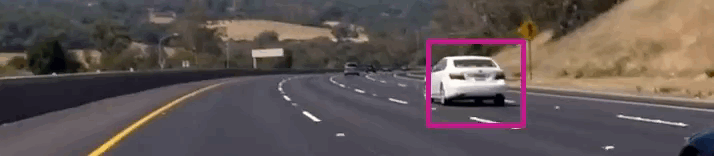

# Self-Driving Car Engineer Nanodegree
## Vehicle Detection

### Overview
The objective of this project is identify and tracking road vehicles using traditional computer vision and machine learning techniques such as histogram of oriented gradients (HOG) and support vector machines (SVM). In the first phase of the project, we high quality trained a vehicle classifier models using SVM. HOG and special binning techniques were used to extract features. Next, using sliding window method, we extracted imaged patches from road images. Those images patches were used to extract features and ran against SVM model. The output of the SVM indicates whether the given patch is a vehicle or not.

Following animation shows the performance of our final model against a road video.

<p align="center">
    
</p>

### Dependencies

This project requires Python 3.5+ and the following libraries installed.

- [Numpy](http://www.numpy.org/)
- [SciPy](https://www.scipy.org/)
- [OpenCV](http://opencv.org/)
- [Scikit-Learn](http://scikit-learn.org)
- [Matplotlib](http://matplotlib.org/) (Optional)

### How to Run the Vehicle Detector?
TODO: xxx


## Implementation

### Vehicle Detection Pipeline

Following figure shows the Vehicle detection pipeline we used for this project. As picture depicted, pipeline starts with the sliding window process. Next, the extracted image patch goes to the feature generation stage. Generated features are used as the input of the machine learning algorithm. For this project, we used Linear Support Vector Machine as our machine learning algorithm. Based on the output of the machine learning model, we added sliding windows to the heat map. Finally, heat map is thresholded to extract vehicle bounding boxes.

Next, we are going to discuss these pipeline stages in detail.  

### Sliding Windows for Identifying Vehicles
xxx

### Feature Extraction

The success of traditional machine learning algorithms is mainly depends in the features we used to train that algorithms
.
###### Histogram of Oriented Gradients (HOG)
xxxx

###### Spacial Binning

xxxx

### Training the Machine Learning Model
When it comes to selecting a machine learning algorithm for vehicle tracking problem, I had two concerns namely: accuracy and speed. So I picked Linear SVM classifier because it provides a reasonable trade off between speed and accuracy.

The subset of vehicle and non-vehicle images of the [GTI Vehicle Image Database](http://www.gti.ssr.upm.es/data/Vehicle_database.html) was used for the training. The sample of vehicle and non-vehicle images of that dataset is shown below.

<p align="center">
    
</p>

<p align="center">
    
</p>

It is a well-known fact that, hyper-parameter optimization is one of the key steps in building machine learning models and picking the most suitable hyper-parameter helps a lot to get the best predictive performance. Hence, we put a reasonable effort to the best possible hyper-parameter in order to optimize the performance of our models.

We used **Grid Search** hyper-parameter optimization method and following are the optimized hyper-parameter values we manged to estimate for out Linear SVM model.

1. Penalty parameter (C): C: 0.08
2. Penalty: l2
3. Loss: hinge

In addition to the hyper-parameters of the Linear SVM, we have few parameters in our vehicle detection system such as `spatial_size`, `pix_per_cell`, and `HOG orientations`. For those parameters, we used best recommended values available in computer vision literature.

### Handling False Positives and Multiple Detectors

If you the vehicle detector which consists of above pipeline stages, you might see multiple bounding boxes. Also, detector sometimes reports some false positive detectors as well. One such example is given below.

<p align="center">
    
</p>

**Heat-maps**  are used to remove both false positives and multiple detectors. Heat-map work as follows.

1. Initialize heat-map image with dimension equals to the dimension of the input images.
2. Add "heat" (+=1) for all pixels within windows where a positive detection is reported by your classifier.
3. The hot parts of the map are where the cars are, and by imposing a threshold, I rejected areas affected by false positives.

The **`add_heat(heatmap, bbox_list)`** and **`apply_threshold(heatmap, threshold)`** methods in the **`helper`** file encapsulate the functionalities described in above three items. Based on the output of the **`apply_threshold(heatmap, threshold)`** methods, we draw bounding boxes around each detected cars.

In addition to **`add_heat(heatmap, bbox_list)`**  and **`apply_threshold(heatmap, threshold)`** we have created a separate class call **`FrameQueue`** in the **`vehicle`** file in order to improve the smoothness of the bounding boxes. It saves last `N` (configurable) number of heat-maps. When it comes to predicting thresholded heat-map, we take the average of last `N` heat-maps and that average heat-map passed to the **`apply_threshold(heatmap, threshold)`** method.

## Output
In order to easily work with both images and videos, we have created a class (indide the **`vehicle`** file) called **`VehicleDetector`**. It encapsulates methods described above and provides an easy to use interface: **`detect(self, input_image)`**. **`detect`** method accept road images as input and produces annotated images as output.

Following section shows how we can use **`VehicleDetector`** with road images and videos.

```Python
x_start_stop=[None, None]
y_start_stop = [400,600]
xy_window=(96, 85)
xy_overlap=(0.75, 0.75)
vehicle_detector = vehicle.VehicleDetector(color_space=color_space,
                                  orient=orient,
                                  pix_per_cell=pix_per_cell,
                                  cell_per_block=cell_per_block,
                                  hog_channel=hog_channel,
                                  spatial_size=spatial_size,
                                  hist_bins=hist_bins,
                                  spatial_feat=spatial_feat,
                                  hist_feat=hist_feat,
                                  hog_feat=hog_feat,
                                  y_start_stop=y_start_stop,
                                  x_start_stop=x_start_stop,
                                  xy_window=xy_window,
                                  xy_overlap=xy_overlap,
                                  heat_threshold = 1,
                                  scaler=scaler,
                                  classifier=svc)

sample_image_path = './test_images/test6.jpg'
sample_image = mpimg.imread(sample_image_path)
sample_output = vehicle_detector.detect(sample_image)
```
<p align="center">
    
</p>

```python
x_start_stop=[None, None]
y_start_stop = [400,600]
xy_window=(96, 85)
xy_overlap=(0.75, 0.75)
vehicle_detector = vehicle.VehicleDetector(color_space=color_space,
                                  orient=orient,
                                  pix_per_cell=pix_per_cell,
                                  cell_per_block=cell_per_block,
                                  hog_channel=hog_channel,
                                  spatial_size=spatial_size,
                                  hist_bins=hist_bins,
                                  spatial_feat=spatial_feat,
                                  hist_feat=hist_feat,
                                  hog_feat=hog_feat,
                                  y_start_stop=y_start_stop,
                                  x_start_stop=x_start_stop,
                                  xy_window=xy_window,
                                  xy_overlap=xy_overlap,
                                  heat_threshold = 15,
                                  scaler=scaler,
                                  classifier=svc)

output_file = './processed_project_video.mp4'
input_file = './project_video.mp4'

clip = VideoFileClip(input_file)
out_clip = clip.fl_image(vehicle_detector.detect)
out_clip.write_videofile(output_file, audio=False)
```
<p align="center">
    <a href="https://www.youtube.com/watch?v=ZNmvFZJRKWA">
        
    </a>
</p>


## Conclusions and Future Improvements


## References

[1]. xxxx

[2]. zzzz

[3]. zzzz

----------------------------------------------------
# Vehicle Detection
[](http://www.udacity.com/drive)


In this project, your goal is to write a software pipeline to detect vehicles in a video (start with the test_video.mp4 and later implement on full project_video.mp4), but the main output or product we want you to create is a detailed writeup of the project.  Check out the [writeup template](https://github.com/udacity/CarND-Vehicle-Detection/blob/master/writeup_template.md) for this project and use it as a starting point for creating your own writeup.  

Creating a great writeup:
---
A great writeup should include the rubric points as well as your description of how you addressed each point.  You should include a detailed description of the code used in each step (with line-number references and code snippets where necessary), and links to other supporting documents or external references.  You should include images in your writeup to demonstrate how your code works with examples.  

All that said, please be concise!  We're not looking for you to write a book here, just a brief description of how you passed each rubric point, and references to the relevant code :).

You can submit your writeup in markdown or use another method and submit a pdf instead.

The Project
---

The goals / steps of this project are the following:

* Perform a Histogram of Oriented Gradients (HOG) feature extraction on a labeled training set of images and train a classifier Linear SVM classifier
* Optionally, you can also apply a color transform and append binned color features, as well as histograms of color, to your HOG feature vector.
* Note: for those first two steps don't forget to normalize your features and randomize a selection for training and testing.
* Implement a sliding-window technique and use your trained classifier to search for vehicles in images.
* Run your pipeline on a video stream (start with the test_video.mp4 and later implement on full project_video.mp4) and create a heat map of recurring detections frame by frame to reject outliers and follow detected vehicles.
* Estimate a bounding box for vehicles detected.

Here are links to the labeled data for [vehicle](https://s3.amazonaws.com/udacity-sdc/Vehicle_Tracking/vehicles.zip) and [non-vehicle](https://s3.amazonaws.com/udacity-sdc/Vehicle_Tracking/non-vehicles.zip) examples to train your classifier.  These example images come from a combination of the [GTI vehicle image database](http://www.gti.ssr.upm.es/data/Vehicle_database.html), the [KITTI vision benchmark suite](http://www.cvlibs.net/datasets/kitti/), and examples extracted from the project video itself.   You are welcome and encouraged to take advantage of the recently released [Udacity labeled dataset](https://github.com/udacity/self-driving-car/tree/master/annotations) to augment your training data.  

Some example images for testing your pipeline on single frames are located in the `test_images` folder.  To help the reviewer examine your work, please save examples of the output from each stage of your pipeline in the folder called `ouput_images`, and include them in your writeup for the project by describing what each image shows.    The video called `project_video.mp4` is the video your pipeline should work well on.  

**As an optional challenge** Once you have a working pipeline for vehicle detection, add in your lane-finding algorithm from the last project to do simultaneous lane-finding and vehicle detection!

**If you're feeling ambitious** (also totally optional though), don't stop there!  We encourage you to go out and take video of your own, and show us how you would implement this project on a new video!
